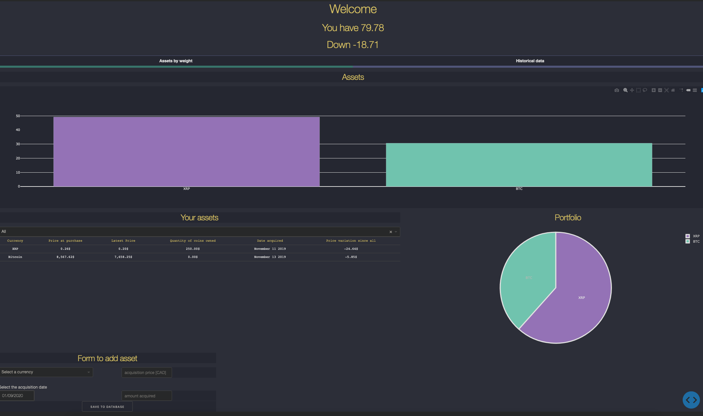
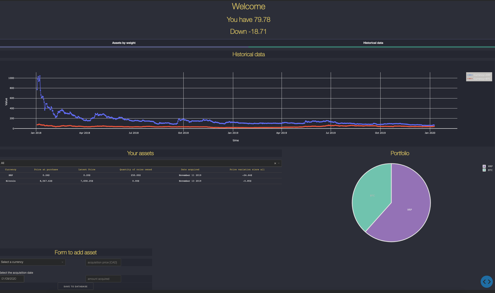

# Cryptocurrency dashboard / portfolio

The end goal of this project was to have a local-running webpage on my NAS that
enable me to just log into it and check the value of my assets for the past few days/weeks
and their current values.

The project was highly inspired by this other project from [elpunk project](https://github.com/elpunkt/coin-dashboard)


  
  


The data is retrieve in two manners :
1. The historical data is retrieve through the yahoo api. There have been some issues with it in the past
2. The latest data (today) are retrieve throught the coinmarketcap API.

Why not use only one API you may ask?
Excellent question. I started to use coinmarketcap because it was free and easy to use.
To retrieve historical data, I needed a paid account, but I am cheap. So, hey yahoo!
And I just did not take the time to modify the code to use the yahoo api for the latest data.

The good news is the code is open-source so you are welcome to modify and share it.
Also, there is no need for an account on the yahoo api

## Prerequisites
I installed conda. I don't have to explain why. But actually if you are reading this, I just think the packages are easier to remove than using pip on mac. Personal preferences, you know. You might think I am wrong. I don't care
Here is the package list needed :
```
- dash-core-components
- requests
- pandas-datareader
```
If you are using `conda`
You can do the following
```
export PATH=~/opt/anaconda3/bin:$PATH
source ~/.zshrc
conda install -c conda-forge dash-core-components
conda install -c conda-forge/label/gcc7 dash-core-components
conda install -c conda-forge/label/cf201901 dash-core-components
conda install -c anaconda requests
conda install -c anaconda pandas-datareader
```

You will need an account on [coinmarketcap](https://pro.coinmarketcap.com/signup) and an api key (free) which you will copy-paste
into db_operations.py here :

```python
latest_url = 'https://pro-api.coinmarketcap.com/v1/cryptocurrency/listings/latest'
headers = {
  'Accepts': 'application/json',
  'X-CMC_PRO_API_KEY': 'xxxx-xxxxx-your-api-goes-here-xxxxxx',
}
parameters = {
  'start':'1',
  'limit':'20',
  'convert':'CAD'
}
```
You can also modify the `convert` value to AUD or USD if you prefer.

## Installing
You need to create the sqlite database tables.
For this, there is some manual work. sorry ¯\_(ツ)_/¯

I left you a sample database so you can test it right away and figure out
if you miss dependencies or anything else.  

To get your historical data, in an hypothetical case where you bought BTC on 3rd of January 2018, do the following in the project folder :
1. Modify the function.  
Go into `db_operations.py`.  At the end of the file, there is a function named `Create_Historical_data()`.
You need to modify some parameters in there. The first 6 not-commented lines.
```python
start_date=datetime.datetime(2018,1,3)
end_date=datetime.datetime(2020,1,10) => todays date
tickers=['BTC-CAD','XRP-CAD']         => Tickers you got in your folio
short_name=['BTC', 'XRP']             => currency long name
long_name=['Bitcoin', 'XRP']          => currency symbol or short name
```

Here, if you selected USD or AUD previously in the `convert` parameter. I would advise to not use the canadian ticker. BTC-AUD and BTC-USD exists
The last two parameters can be tricky. They are of no importance right now, but later
they will be read to retrieve the latest data from coinmarketcap API. Thus, they have to match what they have.  
2.   Run the function  
```
python3
import db_operations
db_operations.Create_Historical_data()
```
Do 1 and 2 for every currency you got. Firefox SQLite manager add-on can help you to check your data.
Here are some commands to do this, but you don't have to :
```
open your database
pragma table_info(historical_data_table)
SELECT * FROM historical_data_table
```
3. Fill data into the `purchase_history_table`
Now, you have to create the `purchase_history_table` (basically when did you buy your coins)
Still in your project folder:
```
python3
import db_operations
db_operations.write_to_database('purchase_history_table',['currency_name_long', 'currency_name_short','CAD_price_at_purchase', 'quantity_of_currency_acquired', 'acquisition_date'], ['Bitcoin','BTC','800', '8500', 20, 'January 03 2018'])
```
The function `write_to_database` takes the `table name`, the `list of column to modify`, the `values`
## Starting the server
```
python3 dashboard.py
```
You can navigate to either
http://127.0.01:8050
or if running on your NAS like me,
http://your-nas-address:8050

## To DOS
- [ ] Create a function and UI element to remove purchase (represent sells)
- [ ] Add a verification when buying multiple time the same currency
    - [ ] Verify if assets exist and if yes, then add crypto_quantity altogether and add to the "average cost" column
    - [ ] Add a column to the purchase_history_table to calculate the average value of purchase
- [ ] There is a difference between tab1 and tab2 [total per asset] vs [historical data]. This seems to be caused by the fact the data are picked from different API (yahoo vs coinmarketcap) at the first time. If the get_data timer works properly, this should resolve by itself as the coinmarketcap data is put into both tables, thus will start using the same data
- [ ] When modifying the price variation time, modify also the x-axis of the historical tab to reflect the time
- [x] Create a title :
```
			you have 25000$
			200$ in returns
```
- [x] Add a column to the UI-table to show growth/loss in $
        It is also possible to modify the growth time (last 7 days, month etc)
- [x] Create a debug flag. It can be activated/desactivated by setting DEBUG_FLAG in
        db_operations.py as True or False. Output is in console
- [x] Add pagination to the purchase_history_table table.
